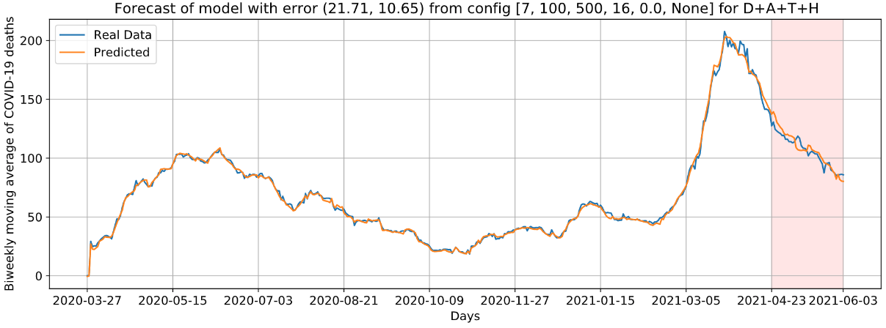

# Multivariate Data Driven Prediction of COVID-19 Dynamics: Towards New Results with Temperature, Humidity and Air Quality Data
## Code and data repository

The main code is on [final_file_forecast_SPSP.ipynb](final_file_forecast_SPSP.ipynb). The data used to train the models is on file [df_spsp_pred.csv](df_spsp_pred.csv). Folder [experiments](experiments) contains all files (models and errors) used to generate the plots presented in the paper. Some of the files names are in portuguese, so a quick translation is: mortes (Deaths), casos (Cases), temperatura (Temperature). Experiment [casos-aqi-temp-humid_mortes](experiments/casos-aqi-temp-humid_mortes) wasn't added to the paper due to poor performance.

## Reference for citing

### Authors

* Davi H. dos Santos (UFRN University, Natal, Brazil)
* Dunfrey P. Aragão (UFRN University, Natal, Brazil)
* Andouglas G. da Silva Junior (IFRN Institute, Natal, Brazil)
* Igor G. Pereira (UFRN University, Natal, Brazil)
* Luiz M. G. Gonçalves (UFRN University, Natal, Brazil)
* ...

## Acknowledgments

* CAPES Edital 12/2020 - Telemedicinas e Análise de Dados Médicos
